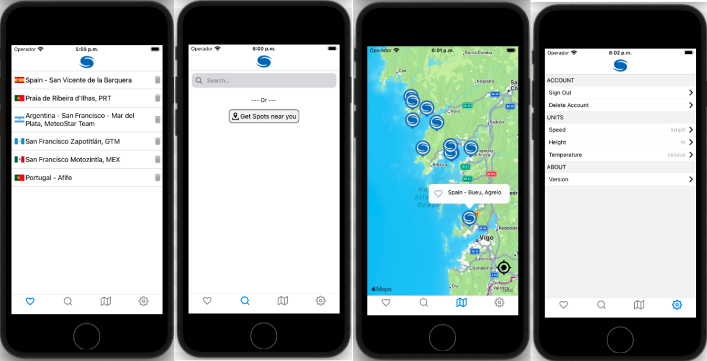
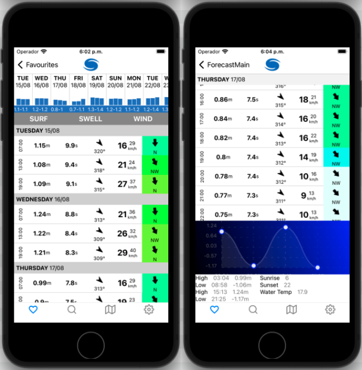

# Wave Guru

Android and IOS app that connects with WindGuru API to fetch data. I presented and offered the app as an open source project to Windguru owner but he is not interested to mantain and develop a Mobile App as WindGuru uses Progressive Web App.
The app has been deployed though EAS for internal distribution and server is hosted in Render.com.

## Screenshots

## Features

- OAuth2 & Auth through own server.
- Weekly forecast overview + daily detail
- Tide Graph
- Map with spots

## Tech Stack

- Frontend: ReactNative, Typescript
- Backend: Node.js, Express, Mongoose
- Database: MongoDB
- Hosting: EAS , Render.com
